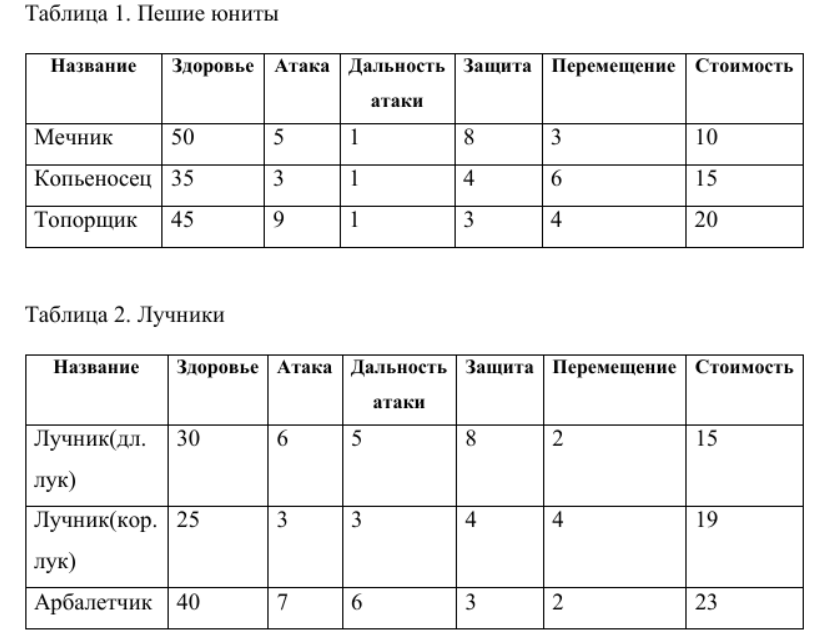
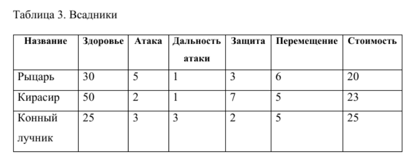
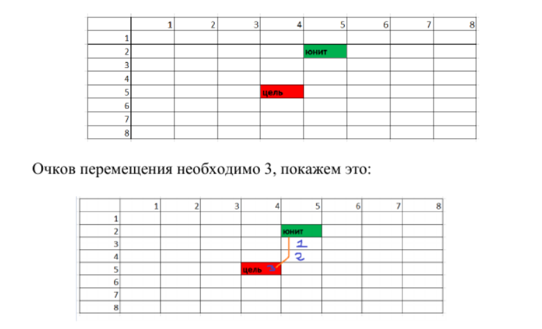
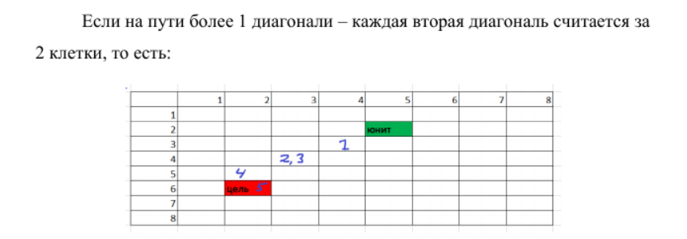
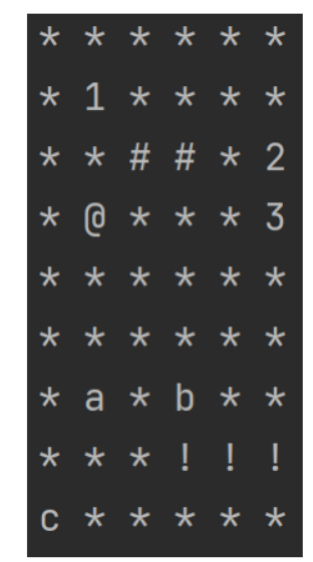
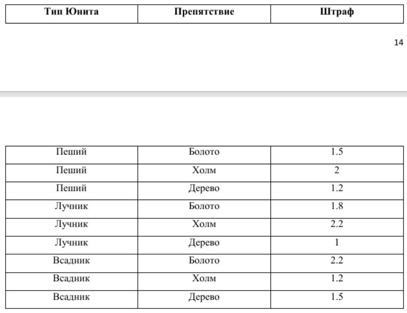

# LABA-2-PROGA
Глоссарий предметной области:
Событие – некоторое мероприятие, направленное на улучшение или
ухудшение боеготовности юнитов
Город – местность, в которой происходят все События
Здание – некоторый объект в Городе, необходимый для некоторых
Событий
Юнит – минимальная единица, участвующая в Сражении
Стоимость – количество денег, которые необходимо отдать за найм
Юнита
Оружие – предмет, принадлежащий Юниту и определяющий тип
урона, который Юнит может нанести
Животное – существо, используемое для перемещения некоторых
типов Юнитов
Атака – свойство Юнита, указывающее на размер урона, который он
может нанести
Защита – свойство Юнита, указывающее на размер урона, который он
может поглотить
Местность – характеристика клетки Поле битвы, вид, влияющий на
Штраф к перемещению Юнитов.
Поле битвы – поле в формате «мир-сетка», состоящее из Местностей,
на котором происходит Сражение двух противников
Перемещение – сущность, показывающая перемещение Юнита и
набор штрафов, если таковые есть
Штраф перемещения – сущность, показывающая штраф на
перемещение по особому типу Местности
Сражение – основной процесс игры, происходящий на Поле битвы,
заканчивается тогда, когда у одного из противников заканчиваются Юниты.
Бот – алгоритм компьютера, против которого играет пользователь.

Задание:
Глобально, существует 3 типа юнитов – Пешие, Лучники и Всадники.
В таблицах 1-3 представлены типы Юнитов и основные различия между
ними. В таблицах ниже представлены примерные характеристики, вы можете
использовать другие, но с сохранением пропорций(например, если в таблице
у Мечника атака 3, а у Топорщика 5, то вы можете использовать любые
числа, но с сохранением того, что атака Топорщика больше атаки Мечника).    

Примечание 1 – логика расчета дальности атаки лучников остается на
усмотрение студента. Можно использовать округление от Евклидова
расстояния между двумя точками, можно использовать систему,
аналогичную классическим НРИ – клетки считаются за 1, каждая вторая
диагональная клетка считается за 2, можно любой другой способ. Логика
расчета перемещения такая же. Приведем пример логики расчета
аналогичную классическим НРИ:

Расчет сражения
Если позволяет Дальность атаки, то в рамках хода игрок может
совершить Атаку. Урон Здоровью юнита определяется как Урон атаки –
Оставшаяся защита Юнита. Пусть был Мечник и ХП 15, защитой 6 На него
нападет Топорщик с атакой 9 В результате у Мечника останется 12 ХП и
защита 0 Очки атаки в первую очереди тратятся на пробитие брони. В
следующем столкновении с Мечником его броня считается равной 0
Поле битвы
Так как наша игра исключительно консольная, поле битвы
представляет собою квадрат, размером пусть 15 на 15 клеток. Каждая клетка
может быть занята только одним Юнитом. Клетка может быть обычной или
специальной(это клетки, перемещение по которым ведет к штрафу). Пример:

Легенда:
 * - обычная клетка
 # - Болото
 @ - Холм
 ! – Дерево
 1, 2, 3 – Юниты игрока
 a, b, c – Юниты противника
Подчеркиваю, это исключительно пример. Вы можете использовать
любые другие обозначения, любого вида, цвета и т.д.

Штраф к перемещению:
В таблице ниже приведены примерные штрафы на перемещение,
накладываемые на тип Юнита в зависимости от типа препятствия.

Примечание: если штраф равен 1 – значит, штрафа нет. В остальных
случаях считается коэффициент. Например, если Пеший юнит идет через
Болото, то каждая клетка Болота считается за 1.5 клетки при перемещении.
Также, препятствия можно только обходить, находится на них нельзя.
Ход
За ход пользователь может сделать каждым своим юнитом
перемещение и атаку, или что-то одно, или не делать вообще ничего. После
каждого действия пользователя выводится обновленное Поле битвы и
статистика (если это была атака). Когда заканчиваются все действия – ход
переходит к другому игроку.
Бот
Компьютер в данной ситуации играет очень просто – если есть
возможность атаковать – он ТОЛЬКО атакует, не осуществляет
перемещения. Если атаковать некого – он просто перемещается вперед на
некоторую свою скорость (можно считать на максимальную).
Конец игры
Игра заканчивается тогда, когда заканчиваются все Юниты у одного из
игроков. Когда ХП Юнита становится равным 0 он считается убитым и
исчезает с карты.